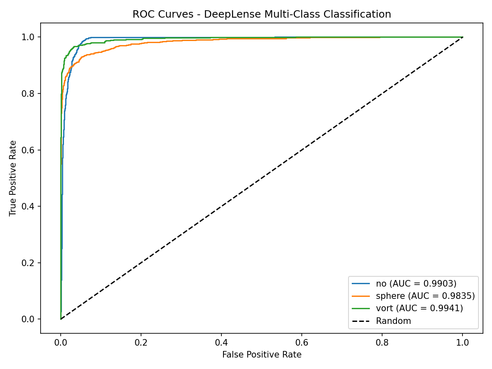
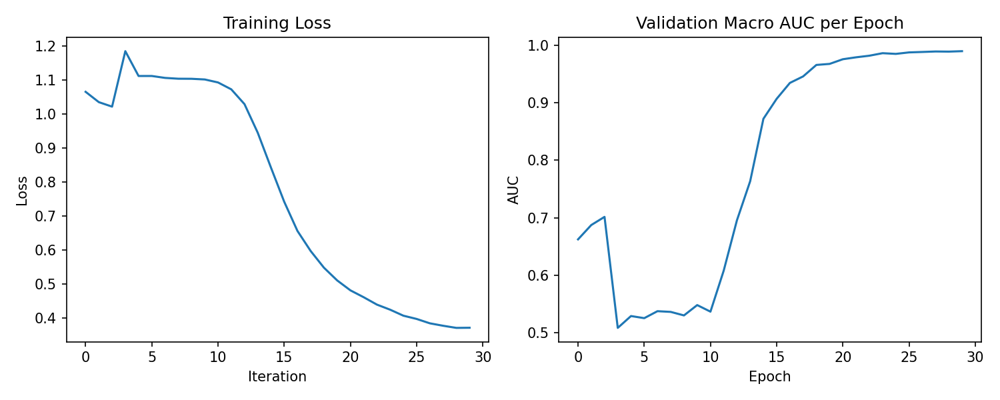
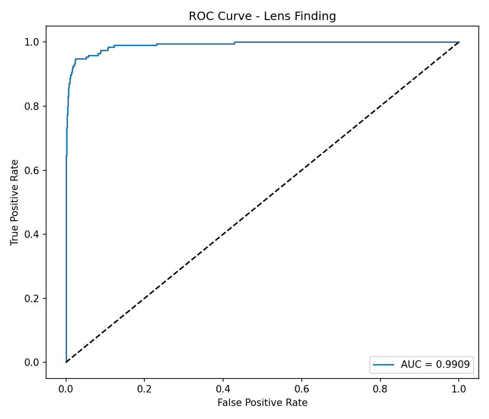
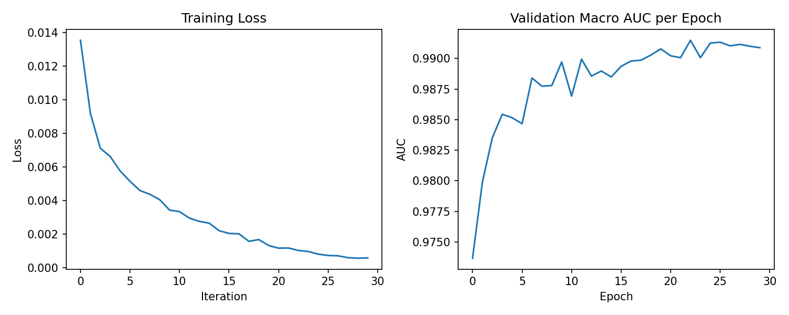

# DeepLense — GSoC 2026 Test Submissions

**Applicant:** Chaitanya Parate  
**GitHub:** [github.com/ChaitanyaParate](https://github.com/ChaitanyaParate)  
**Project:** [DEEPLENSE6 — Gravitational Lens Finding](https://ml4sci.org/gsoc/2026/proposal_DEEPLENSE6.html)  
**Organization:** ML4Sci

---

## Results Summary

| Task | Model | Metric | Score |
|------|-------|--------|-------|
| Common Task I (Multi-Class Classification) | ViT-B/16 | Macro AUC | **0.9893** |
| Common Task I | ViT-B/16 | Accuracy | **93.95%** |
| Specific Test V (Lens Finding) | ResNet-18 | AUC | **0.9909** |

### Common Task I — Per-Class AUC

| Class | AUC |
|-------|-----|
| No substructure | 0.9903 |
| Sphere (subhalo) | 0.9835 |
| Vortex | 0.9941 |

---

## Repository Structure

```
DEEPLENSE-GSOC2026/
├── common_task/
│   ├── deeplense-common-test.ipynb   # Main notebook — all outputs visible
│   ├── dataset.py                    # Custom .npy dataset loader
│   ├── model.py                      # ViT-B/16 with channel expansion
│   ├── train.py                      # Training loop with AMP
│   ├── utils.py                      # Normalisation, metrics
│   └── results/
│       ├── roc_curves.png
│       └── training_curves.png
│
└── Lens_Finding/
    ├── deeplense-lens-finding.ipynb  # Main notebook — all outputs visible
    ├── dataset.py                    # LensDataset for .npy directory pairs
    ├── model.py                      # ResNet-18 with modified conv1 + identity maxpool
    ├── loss.py                       # Focal Loss (alpha=0.25, gamma=2.0)
    ├── train.py                      # Training loop
    ├── utils.py                      # WeightedRandomSampler, ROC-AUC evaluation
    └── results/
        ├── roc_curve.png
        └── training_curves.png
```

---

## Common Task I — Multi-Class Classification

**Task:** Classify strong lensing images into three classes: no substructure, subhalo substructure, vortex substructure.

**Architecture:** Vision Transformer ViT-B/16 (pretrained ImageNet, fine-tuned). Single-channel `.npy` images are expanded to 3 channels to match pretrained weights. Albumentations transforms with `max_pixel_value=1.0` normalisation.

**Training:** CrossEntropyLoss, AdamW (lr=1e-4, weight_decay=0.05), CosineAnnealingLR, 30 epochs, batch size 64, single T4 GPU on Kaggle.

**Evaluation:** 90:10 train-test split, ROC-AUC computed one-vs-rest per class.

**ROC Curves:**



**Training Curves:**



**Notebook:** [`common_task/deeplense-common-test.ipynb`](common_task/deeplense-common-test.ipynb)

**Model Weights:** [Google Drive — vit_lensing_best.pth.tar](https://drive.google.com/file/d/1QUQVvnVlzcjbpooHlQkoIJWSapBjKa91/view?usp=sharing)

---

## Specific Test V — Gravitational Lens Finding

**Task:** Binary classification of SDSS observational data (lensed vs. non-lensed galaxies). Severe class imbalance — non-lenses heavily outnumber lenses.

**Architecture:** ResNet-18 with two modifications for small (64×64) inputs:
- `conv1`: 7×7 → 3×3 kernel, stride 7→1, to preserve spatial resolution in early layers
- `maxpool`: replaced with `nn.Identity()` to avoid over-downsampling

**Class imbalance strategy:** `WeightedRandomSampler` to balance mini-batches + Focal Loss (α=0.25, γ=2.0) to down-weight easy negatives during training.

**Training:** AdamW (lr=1e-4, weight_decay=0.05), CosineAnnealingLR, 30 epochs, batch size 128, per-channel 1st–99th percentile clipping.

**Data split note:** Test V provides a pre-defined directory split (`train_lenses`, `train_nonlenses`, `test_lenses`, `test_nonlenses`) per the task specification. The test directories are held out entirely and never used during training or model selection. This supersedes the general 90:10 guideline.

**ROC Curve:**



**Training Curves:**



**Notebook:** [`Lens_Finding/deeplense-lens-finding.ipynb`](Lens_Finding/deeplense-lens-finding.ipynb)

**Model Weights:** [Google Drive — classification_lensing_best.pth.tar](https://drive.google.com/file/d/1rbnTPaR2WwiouKjLDDUNKKcL9MXrMN3B/view?usp=sharing)

---

## Environment

```
torch==2.x
torchvision
timm
albumentations
scikit-learn
numpy
matplotlib
tqdm
```

Trained on Kaggle (T4 GPU, single GPU).
